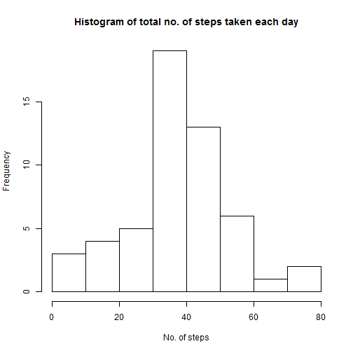
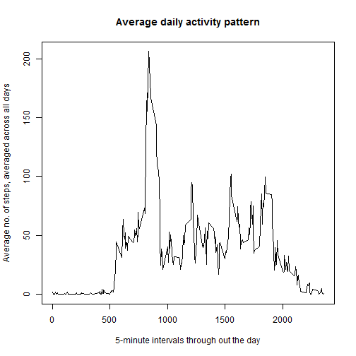
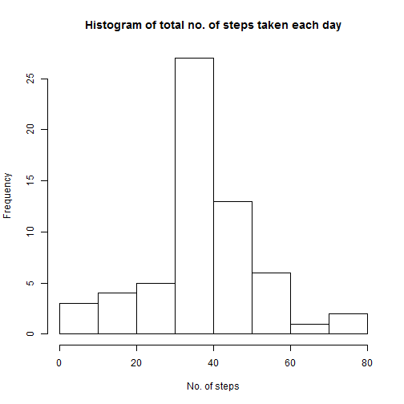

Reproducible Research: Peer Assignment 1
================================================
##Loading and preprocessing of data
It is assumed that the `activity.csv` data file is placed under the working directory.

```r
a <- read.csv("activity.csv") #load data
a$date <- as.Date(a$date) #change the format of "date" variable into date
```
##Mean total number of steps taken per day


```r
avgstp <- aggregate(a$steps, by=list(a$date), FUN=mean, na.rm=TRUE) #aggregate avegrage steps per day
hist(avgstp$x, main="Histogram of total no. of steps taken each day", xlab="No. of steps")
```

 
  
###Mean of total no. of steps taken per day

```r
mean(avgstp$x, na.rm=TRUE)
```

```
## [1] 37.3826
```
###Median of total no. of steps taken per day

```r
median(avgstp$x, na.rm=TRUE)
```

```
## [1] 37.37847
```

##Average daily activity pattern
**reshape** package is used here. Install it by running `install.packages("reshape")`

```r
library(reshape)
md <- melt(a, id=c("date","interval"))
cmd <- cast(md, interval~variable, mean, na.rm=TRUE)
plot(cmd, type="l", main="Average daily activity pattern", xlab="5-minute intervals through out the day", ylab="Average no. of steps, averaged across all days")
```

 
  
###The 5-minute interval which contains the maximum no. of steps (on average across all days)

```r
cmd$interval[which.max(cmd$steps)]
```

```
## [1] 835
```
##Imputing missing values
###Total no. of missing values in the dataset

```r
sum(is.na(a))
```

```
## [1] 2304
```
###Replacing missing values

```r
b <- a #putting the read data into another place
for(i in 1:nrow(b)){
  if(is.na(b$steps[i])){
    b$steps[i] <- cmd$steps[which(cmd$interval==b$interval[i])]
  }
}
```


```r
avgstp_b <- aggregate(b$steps, by=list(b$date), FUN=mean, na.rm=TRUE) #aggregate avegrage steps per day
hist(avgstp_b$x, main="Histogram of total no. of steps taken each day", xlab="No. of steps")
```

 
  
###Mean of total no. of steps taken per day

```r
mean(avgstp_b$x, na.rm=TRUE)
```

```
## [1] 37.3826
```
###Median of total no. of steps taken per day

```r
median(avgstp_b$x, na.rm=TRUE)
```

```
## [1] 37.3826
```
The mean and median values don't differ from the estimates from the first part of the study (mean 37.37847, median 37.3826 previously).  
There's no impact of imputing missing data on the estimates of the total number of steps taken each day.

##Activity patterns between weekdays and weekends
###Creating a new factor variable called **weekday**


```r
b$weekday <- NA
for(i in 1:nrow(b)){
  if(weekdays(b$date[i]) %in% c("Saturday","Sunday")){
    b$weekday[i] <-0
  }
  else b$weekday[i] <-1
}
b$weekday <- factor(b$weekday, labels= c("weekend","weekday"))
```


```r
wd <- b[b$weekday=="weekday",] #subsetting weekday data
we <- b[b$weekday=="weekend",]

library(reshape)
md_wd <- melt(wd, id=c("weekday","date","interval"))
md_we <- melt(we, id=c("weekday","date","interval"))

cmd_wd <- cast(md_wd, interval~variable, mean, na.rm=TRUE)
cmd_we <- cast(md_we, interval~variable, mean, na.rm=TRUE)

cmd_wd$weekday <- "weekday"
cmd_we$weekday <- "weekend"

cmd2 <- rbind(cmd_wd,cmd_we)

library(lattice)
xyplot(steps ~ interval | factor(cmd2$weekday), data=cmd2, type="l", layout= c(1,2))
```

 

